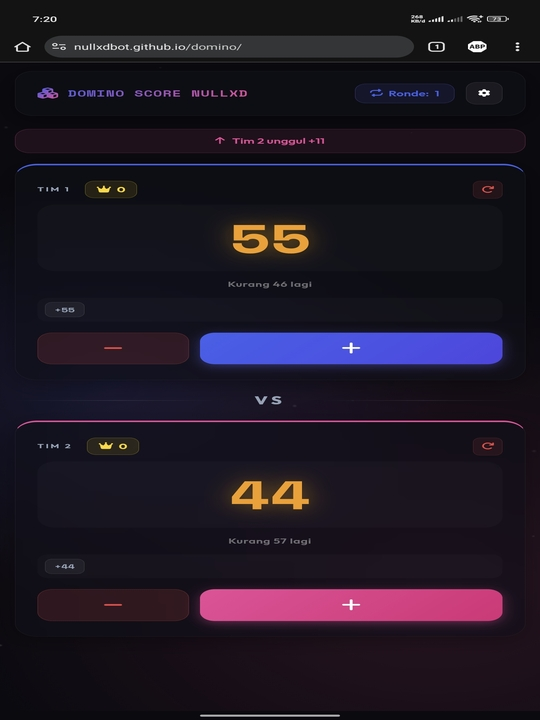
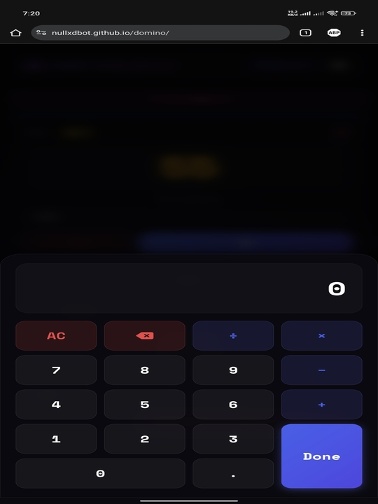
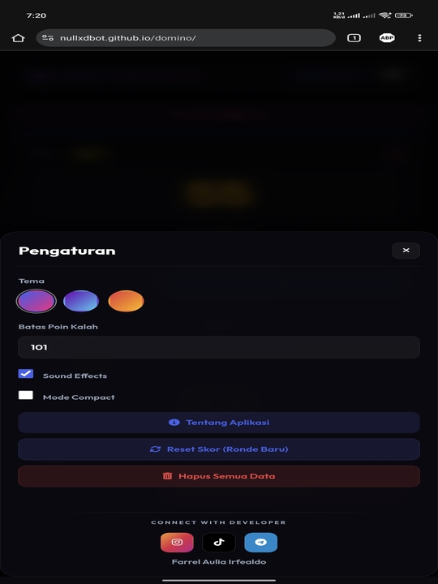

# 🎲 Domino Score NullXD

[](https://github.com/nullxdbot/domino)
[](LICENSE)
[](https://web.dev/progressive-web-apps/)

> Modern, beautiful, and feature-rich score keeper untuk permainan domino 🃏

[Live Demo](https://nullxdbot.github.io/domino/) | [Report Bug](https://github.com/nullxdbot/domino/issues) | [Request Feature](https://github.com/nullxdbot/domino/issues)

---

## 📸 Screenshots

<div align="center">
  
  
  
</div>

---

## ✨ Features

### 🎯 Core Features
- ✅ **Real-time Score Tracking** - Update skor secara langsung
- ✅ **Built-in Calculator** - Kalkulator terintegrasi untuk perhitungan cepat
- ✅ **Score History** - Track semua perubahan skor
- ✅ **Win Counter** - Hitung jumlah kemenangan tiap tim
- ✅ **Progress Bar** - Visual indicator progress menuju target
- ✅ **Score Difference Indicator** - Lihat selisih skor real-time

### 🎨 Design & UX
- ✅ **Modern UI/UX** - Interface yang clean dan intuitive
- ✅ **4 Color Themes** - Purple, Blue, Green, Pink
- ✅ **Dark Mode** - Eye-friendly untuk main malam
- ✅ **Glassmorphism Effect** - Modern visual aesthetics
- ✅ **Smooth Animations** - Transisi yang mulus
- ✅ **Responsive Design** - Support semua ukuran layar
- ✅ **No-Scroll Layout** - Both cards fit perfectly on screen

### 🔧 Advanced Features
- ✅ **PWA Support** - Install sebagai aplikasi
- ✅ **Offline Mode** - Bekerja tanpa internet
- ✅ **Auto-save** - Data tersimpan otomatis
- ✅ **Sound Effects** - Audio feedback (dapat di-toggle)
- ✅ **Compact Mode** - Mode tampilan ringkas
- ✅ **Customizable Score Limit** - Atur target skor sesuka hati

---

## 🚀 Quick Start

### Method 1: GitHub Pages (Recommended)

**Live Demo:** [https://nullxdbot.github.io/domino/](https://nullxdbot.github.io/domino/)

Simply open the link and start playing! 🎮

### Method 2: Clone & Run Locally

```bash
# Clone repository
git clone https://github.com/nullxdbot/domino.git

# Masuk ke folder
cd domino

# Run dengan Python
python -m http.server 8000

# Atau dengan Node.js
npx http-server

# Buka browser
# http://localhost:8000
```

### Method 3: Download ZIP

1. Download ZIP dari [Releases](https://github.com/nullxdbot/domino/releases)
2. Extract ke folder
3. Buka `index.html` di browser

---

## 📱 Installation (PWA)

### Desktop (Chrome/Edge)
1. Buka aplikasi di browser
2. Klik icon **Install** di address bar
3. Follow installation prompts

### Mobile (Android/iOS)
1. Buka aplikasi di browser
2. Tap menu (⋮) → **Add to Home Screen**
3. Tap **Add**

---

## 🔧 Installation di Termux (Android)

### Step 1: Install Termux
Download Termux dari [F-Droid](https://f-droid.org/packages/com.termux/) (bukan dari Play Store)

### Step 2: Setup Termux

```bash
# Update package list
pkg update && pkg upgrade

# Install Git
pkg install git

# Install Python (untuk HTTP server)
pkg install python

# Atau install Node.js
pkg install nodejs
```

### Step 3: Clone Repository

```bash
# Clone project
git clone https://github.com/nullxdbot/domino.git

# Masuk ke folder
cd domino
```

### Step 4: Run Server

**Option A: Python Server**
```bash
python -m http.server 8000
```

**Option B: Node.js Server**
```bash
# Install http-server
npm install -g http-server

# Run server
http-server -p 8000
```

### Step 5: Access di Browser

```bash
# Server berjalan di:
http://localhost:8000

# Atau via IP lokal (untuk akses dari device lain):
# Cek IP dengan:
ifconfig

# Access via:
http://192.168.x.x:8000
```

**📖 Full Termux Guide:** [TERMUX_GUIDE.md](TERMUX_GUIDE.md)

---

## 📁 Project Structure

```
domino/
├── index.html              # Main HTML file
├── manifest.json           # PWA manifest
├── sw.js                   # Service Worker
├── README.md               # This file
├── CHANGELOG.md            # Version history
│
├── css/
│   └── style.css           # Main stylesheet
│
├── js/
│   └── app.js              # Main JavaScript
│
├── img/
│   ├── icon-*.png          # PWA icons (72-512px)
│   └── screenshot*.png     # App screenshots
│
└── sfx/
    ├── sfx-click.wav       # Click sound effect
    └── sfx-win.m4a         # Victory sound effect
```

---

## 🎮 How to Use

### Basic Usage

1. **Start Game**
   - Open aplikasi
   - Set score limit (default 101)
   - Pilih tema warna favorit

2. **Add Score**
   - Tap tombol **"+"** atau tap pada angka skor
   - Masukkan angka di calculator
   - Tekan **✓** untuk confirm

3. **Remove Score**
   - Tap tombol **"-"** untuk kurangi 1 poin
   - Atau tap history item untuk hapus score tertentu

4. **New Round**
   - Setelah ada pemenang
   - Tap **"New Round"** untuk mulai lagi
   - Win counter akan bertambah

5. **Reset All**
   - Settings → **"Reset All"**
   - Menghapus semua data termasuk win counter

### Advanced Features

**Calculator Mode:**
- Support operasi: `+`, `-`, `×`, `÷`
- Dapat chain operations
- Backspace untuk hapus digit

**History:**
- Tap pada history chip untuk hapus score
- History tersimpan otomatis

**Themes:**
- 4 pilihan tema: Purple, Blue, Green, Pink
- Auto-save preference

**Compact Mode:**
- Toggle untuk tampilan lebih ringkas
- Ideal untuk layar kecil

**Sound Effects:**
- Toggle on/off di settings
- Click sound & victory sound

---

## ⚙️ Configuration

### Change Score Limit

Settings → **Score Limit** → Enter nilai (contoh: 50, 101, 200)

### Change Theme

Settings → **Color Theme** → Pilih warna

### Toggle Features

- **Sound Effects**: ON/OFF
- **Compact Mode**: ON/OFF

---

## 🛠️ Development

### Prerequisites

```bash
# Node.js (optional, untuk development server)
node --version

# Python (alternative, untuk simple server)
python --version

# Git
git --version
```

### Local Development

```bash
# Clone repo
git clone https://github.com/nullxdbot/domino.git
cd domino

# Run development server
python -m http.server 8000
# atau
npx http-server
```

### Tech Stack

- **Frontend**: Vanilla JavaScript (ES6+)
- **Styling**: CSS3 (Custom Properties, Flexbox, Grid)
- **PWA**: Service Worker, Web App Manifest
- **Storage**: LocalStorage API
- **Audio**: HTML5 Audio API
- **Icons**: Font Awesome 6.4.0
- **Fonts**: Google Fonts (Poppins, JetBrains Mono)

---

## 📝 Changelog

### Version 2.0.1 (Current)
- 🐛 **Fixed**: Score difference indicator showing wrong team
- 🎨 **Optimized**: Layout untuk no-scroll design
- ✅ **Improved**: Both player cards now fit perfectly on screen

### Version 2.0.0
- ✨ Complete UI/UX redesign
- ✨ Added PWA support
- ✨ Added sound effects
- ✨ Added 4 color themes
- ✨ Added compact mode
- ✨ Added score history with delete
- ✨ Added calculator mode
- ✨ Added auto-save functionality

**📖 Full Changelog:** [CHANGELOG.md](CHANGELOG.md)

---

## 🤝 Contributing

Contributions are welcome! 🎉

### How to Contribute

1. **Fork** the repository
2. **Create** your feature branch
   ```bash
   git checkout -b feature/AmazingFeature
   ```
3. **Commit** your changes
   ```bash
   git commit -m 'Add some AmazingFeature'
   ```
4. **Push** to the branch
   ```bash
   git push origin feature/AmazingFeature
   ```
5. **Open** a Pull Request

**📖 Contributing Guide:** [CONTRIBUTING.md](CONTRIBUTING.md)

---

## 🐛 Known Issues

- Audio autoplay might be blocked by browser (requires user interaction)
- Some browsers might not support all CSS features (use modern browsers)

---

## 📋 Roadmap

- [ ] Multi-player support (3-4 players)
- [ ] Game statistics & analytics
- [ ] Export/Import game data
- [ ] Share score via social media
- [ ] Tournament mode
- [ ] Online multiplayer (optional)
- [ ] Multiple languages (i18n)

---

## 📄 License

This project is licensed under the **MIT License** - see the [LICENSE](LICENSE) file for details.

---

## 👨‍💻 Author

**Farrel Aulia Irfealdo** (NullXD)

- 📧 Email: farelauliairfealdo99999@gmail.com
- 🐙 GitHub: [@nullxdbot](https://github.com/nullxdbot)
- 📱 Instagram: [@farrelauliairfealdo_](https://instagram.com/farrelauliairfealdo_)
- 🎵 TikTok: [@farrel.aulia.irfealdo](https://tiktok.com/@farrel.aulia.irfealdo)
- 💬 Telegram: [@farrelauliairfealdo](https://t.me/farrelauliairfealdo)

---

## 💖 Support

Suka dengan project ini? 

[](https://saweria.co/nullxd)

- ⭐ **Star** repository ini
- 🐛 Report bugs
- 💡 Suggest new features
- ☕ [Buy me a coffee](https://saweria.co/nullxd)

---

## 🙏 Acknowledgments

- [Font Awesome](https://fontawesome.com/) - Icons
- [Google Fonts](https://fonts.google.com/) - Typography
- Inspired by modern score keeper apps
- Thanks to all contributors! 🎉

---

## 📞 Contact & Support

- **Issues**: [GitHub Issues](https://github.com/nullxdbot/domino/issues)
- **Discussions**: [GitHub Discussions](https://github.com/nullxdbot/domino/discussions)
- **Email**: farelauliairfealdo99999@gmail.com

---

<div align="center">

**Made with ❤️ by Farrel Aulia Irfealdo**

🇮🇩 **Indonesia**

[⬆ Back to Top](#-domino-score-nullxd)

</div>
